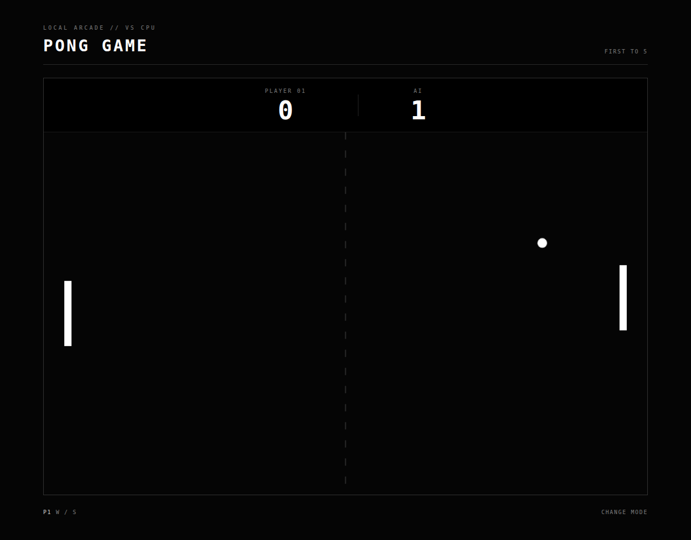

# Pingpong

Browser Pong with three ways to play: two players on one keyboard, one player vs CPU, or a remote match over a shareable link.



The server simulation for remote games runs in a Cloudflare Durable Object so both clients see the same ball and paddles.

## Play

First to **5** wins. Space restarts a finished match.

| Mode | Controls |
| --- | --- |
| Player vs player (same machine) | P1: W / S · P2: ↑ / ↓ |
| vs CPU | W / S or ↑ / ↓ |
| Invite a friend | W / S or ↑ / ↓ (you get the left or right seat) |

**Invite a friend** creates a room id, opens `/play/<roomId>`, and waits until the second player joins that URL. A dropped connection keeps the seat for 15 seconds so a refresh can reclaim it.

## Setup

Needs [pnpm](https://pnpm.io/) and Node 22+.

```bash
pnpm install
pnpm dev
